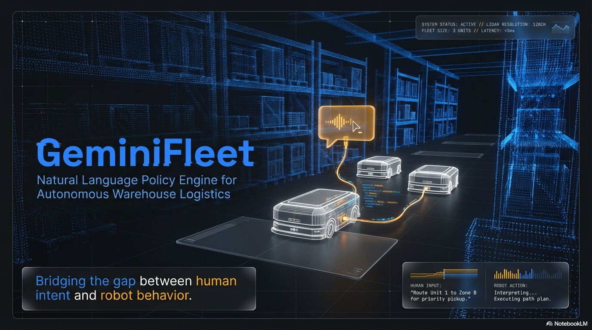

# GeminiFleet - AI-Powered Multi-Robot Warehouse Simulator

A multi-agent warehouse robot simulation built on **PyBullet** physics engine with **Google Gemini** natural language fleet control. Robots autonomously pick up and deliver items in a virtual warehouse, while a fleet manager controls behavior through plain English commands interpreted by Gemini AI.



## Live Demo

**[Try it live → http://207.148.9.252:8000](http://207.148.9.252:8000)**

## Demo Video

[](https://x.com/i/status/2022847149399249344)

[Watch the demo video on X/Twitter](https://x.com/i/status/2022847149399249344)

## Architecture

```
┌──────────────────────────────────────────────────────────────┐
│              Local Machine or Vultr VM                        │
│  ┌─────────────┐    ┌──────────────┐    ┌────────────────┐  │
│  │  PyBullet    │───▶│ Fleet Manager│◀───│ Policy Engine  │  │
│  │  (Physics)   │    │ (Navigation) │    │ (Gemini API)   │  │
│  └─────────────┘    └──────┬───────┘    └────────────────┘  │
│                            │                                 │
│                     ┌──────▼───────┐                        │
│                     │  FastAPI     │                        │
│                     │  WebSocket   │                        │
│                     └──────┬───────┘                        │
│                            │                                 │
│                     ┌──────▼───────┐                        │
│                     │ Web Dashboard│                        │
│                     │  (Browser)   │                        │
│                     └──────────────┘                        │
└──────────────────────────────────────────────────────────────┘
```

## Quick Start

### Prerequisites

| Component | Requirement |
|-----------|-------------|
| **GPU** | None required (PyBullet runs on CPU) |
| **Python** | 3.11 (required by Isaac Sim) |
| **CUDA** | 12.x |
| **OS** | Ubuntu 22.04 or Windows 10/11 |
| **Gemini API Key** | [Get one here](https://aistudio.google.com/apikey) |

### Option 1: Run Locally

```bash
# 1. Clone the repo
git clone <repo-url> geminifleet
cd geminifleet

# 2. Create Python 3.11 virtual environment
python3.11 -m venv .venv
source .venv/bin/activate  # Linux
# .venv\Scripts\activate   # Windows

# 3. Install dependencies
pip install -r requirements.txt

# 4. Set your Gemini API key
export GEMINI_API_KEY="your_key_here"

# 5. Run!
python main.py
```

Open http://localhost:8000 for the web dashboard.

**Command line options:**
```bash
python main.py --gui               # Show PyBullet 3D viewer
python main.py --num-robots 6      # More robots (1-6)
python main.py --port 8080         # Different port
```

### Option 2: Docker on Vultr

```bash
# 1. SSH into your Vultr VM
ssh root@your-vultr-ip

# 2. Clone the repo
git clone <repo-url> geminifleet
cd geminifleet

# 3. Create .env file
cp .env.example .env
# Edit .env and set GEMINI_API_KEY

# 4. Build and run
docker compose up -d

# Dashboard available at http://your-vultr-ip:8000
```

## Deploying to Vultr (Step by Step)

### 1. Create a Vultr VM

- Go to [vultr.com](https://vultr.com) and create an account
- Deploy a new **Cloud Compute** instance:
  - **OS**: Ubuntu 22.04
  - **Plan**: 1 vCPU, 1GB RAM ($5/mo is enough)
  - **Location**: Any
- Note the IP address and root password

### 2. Setup the VM

```bash
# SSH in
ssh root@YOUR_VULTR_IP

# Install Docker
curl -fsSL https://get.docker.com | sh

# Clone project
git clone <repo-url> geminifleet
cd geminifleet

# Configure
cp .env.example .env
nano .env  # Set your GEMINI_API_KEY

# Deploy
docker compose up -d

# Open firewall
ufw allow 8000/tcp
```

### 3. Access the Dashboard

Open `http://YOUR_VULTR_IP:8000` in your browser.

## Using the Dashboard

### Gemini Fleet Control

Type natural language commands in the chat panel to control robot behavior:

| Command | Effect |
|---------|--------|
| "Make robots faster" | Increases speed, reduces safety margin |
| "Prioritize safety" | Slows down, increases collision avoidance distance |
| "Focus on the north side" | Robots prefer north-side tasks |
| "Use random task selection" | Robots pick tasks randomly |
| "Make robots cooperate" | Enables cooperative mode |
| "Reroute around congestion" | Robots find alternate paths when blocked |

### What You See

- **2D Map**: Real-time top-down view of the warehouse
  - Blue squares = pickup zones (where robots collect items)
  - Green squares = dropoff zones (where robots deliver)
  - Brown rectangles = shelf racks
  - Colored circles = robots (dashed lines show planned paths)
- **Robot Panel**: Status of each robot (idle, moving, carrying)
- **Stats**: Deliveries, pending tasks, collision avoidances
- **Policy Panel**: Current fleet behavior parameters

## Project Structure

```
geminifleet/
├── main.py                  # Main entry point (PyBullet + web server)
├── api_standalone.py        # Lightweight standalone mode (no physics engine)
├── simulation/
│   ├── pybullet_sim.py      # PyBullet warehouse simulation
│   ├── warehouse.py         # Warehouse environment (Isaac Sim scene, optional)
│   ├── fleet.py             # Fleet manager (Isaac Sim mode, optional)
│   └── policy.py            # Policy dataclass
├── api/
│   ├── server.py            # FastAPI + WebSocket server
│   └── gemini.py            # Gemini API integration
├── frontend/
│   └── index.html           # Web dashboard (HTML5 Canvas)
├── Dockerfile               # Vultr deployment
├── docker-compose.yml
├── requirements.txt
└── .env.example
```

## Technologies

- **PyBullet** — Physics-based robot simulation (Bullet Physics engine)
- **Google Gemini 2.0 Flash** — Natural language to policy parameter generation
- **FastAPI + WebSocket** — Real-time web API
- **HTML5 Canvas** — 2D dashboard visualization
- **Docker** — Containerized deployment on Vultr

## How It Works

1. **Warehouse Setup**: PyBullet creates a physics environment with walls, shelves, pickup zones, and dropoff stations
2. **Robot Fleet**: Cylindrical robot bodies with collision shapes navigate the warehouse. New robots can be added at runtime
3. **Task System**: Delivery tasks (pickup → dropoff) are generated and assigned to idle robots
4. **Navigation**: Robots use kinematic control with priority-based collision avoidance to prevent deadlocks
5. **Collision Avoidance**: Robots check distances and respond based on policy (wait/reroute/slow down)
6. **Gemini AI**: Natural language commands are sent to Gemini, which returns JSON policy parameters
7. **Real-time Dashboard**: WebSocket pushes simulation state to the browser at ~10Hz

## Infrastructure Requirements

| Mode | CPU | RAM | GPU | Storage | Cost |
|------|-----|-----|-----|---------|------|
| **Local** | 1+ cores | 1GB+ | None | 500MB | Your machine |
| **Vultr** | 1 vCPU | 1GB | None | 500MB | ~$5/mo |

## License

MIT
